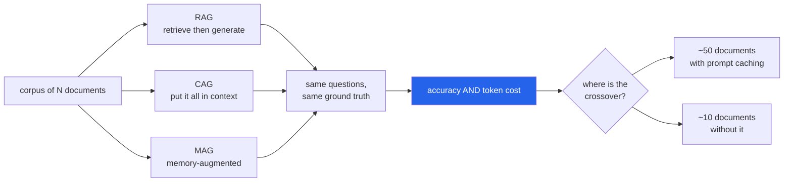

<h1 align="center">context-bench (Python · NumPy · RAG/CAG/MAG)</h1>
<p align="center"><i>RAG vs CAG vs MAG, measured on real data with ground-truth answers - not argued about</i></p>

<p align="center">
  <a href="#the-category-error-everyone-makes">The category error</a> &middot;
  <a href="#the-number-nobody-puts-in-the-comparison">The missing number</a> &middot;
  <a href="#what-it-measures-and-what-it-refuses-to">What it refuses to measure</a> &middot;
  <a href="#the-trade-in-one-question">The trade</a> &middot;
  <a href="#honest-limitations">Limitations</a> &middot;
  <a href="#problems-hit-while-building-this">Problems hit</a>
</p>

<p align="center">
  <a href="https://github.com/hammasbuilds/context-bench/actions/workflows/ci.yml"></a>
  
  
  
  <a href="LICENSE"></a>
</p>

---

## The category error everyone makes



**The number nobody puts in the comparison is the crossover.** CAG is cheaper than RAG up
to roughly 50 documents with prompt caching - and only 10 without it. Below that line the
argument is settled; above it, it reverses.


These four are constantly compared as rivals. Three of them are not:

| | What it is | Answers |
|---|---|---|
| **RAG** | retrieve chunks per query | *where does knowledge come from* |
| **CAG** | preload the whole corpus, lean on the cache | *where does knowledge come from* |
| **MAG** | carry what earlier turns established | *what persists between turns* |
| **MCP** | a protocol for reaching tools | **nothing here — it is plumbing** |

MCP is orthogonal. It belongs in this comparison the way TCP belongs in a debate about
database schemas.

## The number nobody puts in the comparison

**Prompt caching.**

Without it, CAG pays full input price for the entire corpus on every single query and is
absurd past a few thousand tokens. With it, the corpus bills at roughly a tenth after the
first call — and "just put the handbook in the context" stops being a joke.

```
CAG, 400 documents, with caching       $1.89 per 1,000 questions
CAG, 400 documents, without caching   $15.98 per 1,000 questions
```

An 8.4× difference from one pricing parameter. Set the cache price equal to the input price
in the UI and watch the crossover collapse from 50 documents to 10.

## What it measures, and what it refuses to

**No LLM is required, and that is the design.** Three things decide this comparison and
none of them need a single generated token:

- **what reaches the context** — is the gold answer string present in what the model was handed?
- **what it costs** — fresh tokens, cached tokens, output tokens, at prices you set
- **how it scales** — the same question at 10, 25, 50, … 1,600 documents

A strategy that fails the first cannot succeed downstream no matter how good the model is.
Keeping that separate from generation quality is what makes the result arguable.

## The trade, in one question

```
Q: "In what country is Normandy located?"        gold answer: France

RAG sends      710 tokens    4 paragraphs     answer NOT present   X
CAG sends   61,493 tokens  400 paragraphs     answer present       OK
```

RAG's retriever ranked paragraphs about **Warsaw** above the one about Normandy. Twenty
paragraphs in the corpus mention Normandy, and nothing in the query distinguishes the first
one. The answer never reached the model — which no amount of model quality can fix.

That is the canonical RAG failure, and it is the thing CAG buys its 87× token bill to avoid.

## Retrieval quality, measured separately

```
                 recall@1   recall@4   recall@10
lexical (BM25)      69.9%      89.7%       93.4%
semantic            62.9%      84.4%       91.8%
hybrid (RRF)        66.6%      88.3%       92.6%
```

**Hybrid is worse than pure BM25 here**, which was not the expected result. RRF averages a
strong retriever with a weaker one and lands between them. On SQuAD the questions were
written by people looking at the paragraph, so they share its vocabulary and lexical search
is unusually strong — a property of this corpus, stated rather than generalised.

## Running it

```bash
uv sync --all-groups
uv run pytest -q                            # 26 tests, no network
uv run python run_bench.py                  # the full sweep
```

First run fetches SQuAD dev v1.1 (4.8 MB) and caches it. No GPU, no API key, no model
download.

---

## Input


## Output


*The four prices at the top of the input are not decoration. Turning prompt caching off
moves the crossover from 50 documents to 10 — a 3.5x cost swing at n=10 decided by a
pricing flag rather than by anything about retrieval.*

*CAG never loses on recall. It reaches 100% at every corpus size, right up to the point
where it stops fitting in the context window at all.*

---

## Layout

```
src/contextbench/
  corpus.py       SQuAD loading, token estimation, the answer check
  retrieval.py    TF-IDF + BM25 + RRF, pure numpy, no model download
  strategies.py   RAG / CAG / MAG behind one interface, and the pricing model
  bench.py        the harness and the corpus-size sweep
run_bench.py      the sweep, and every number in this README
```

## Honest limitations

- **The retriever is TF-IDF and BM25, not a trained embedding model.** A better retriever
  raises RAG's hit rate. It does not change what the whole corpus costs to preload, or how
  that cost scales — so the headline is if anything *conservative*: better retrieval moves
  the crossover in RAG's favour, and RAG already wins past 50 documents.
- **Tokens are estimated at four characters each**, not tokenized. A real tokenizer changes
  these numbers by a constant factor, not the conclusions.
- **Prices are representative, not any specific vendor's.** They are a parameter of the
  experiment, and the UI exists so you can substitute your own.
- **The answer check is string containment**, not a model judging correctness. It asks
  whether the information was in the room — a cleaner question than one entangled with
  generation quality, and a weaker one. It is named for what it is.
- **SQuAD questions were written by people looking at the paragraph.** That makes lexical
  retrieval unusually strong and this corpus unusually kind to RAG.

## Problems hit while building this

**A retrieval failure that was my stopword list, not the retriever.** "In what country is
Normandy located?" returned paragraphs about Warsaw. The query survived tokenisation as
`["what", "country", "normandy", "located"]` — and `what` appears in nearly every document,
so it and `country` out-voted the one term that identified the answer. Interrogatives
describe the *shape* of the answer, which is the generator's problem, not the index's.
Adding the nine question words lifted recall@4 from 88.0% to 89.7%.

**An empty string was costing a token.** `estimate_tokens` floored at 1, on the reasoning
that a prompt always costs something — true of a prompt, false of a *fragment*. Contexts
here are assembled from parts, so MAG reported one token of memory before it had remembered
anything. Caught by a test asserting `cached_tokens == 0` on the first turn. Now ceiling
division, so absent parts bill for nothing.

**Hybrid retrieval came out worse than lexical alone.** I built RRF expecting it to win and
it lost by 1.4 points. Reported as measured. The argument for hybrid still stands on
robustness across query types — but on this corpus, with these retrievers, it is not the
best choice, and the README says so rather than quietly showing only the hybrid number.

## Keywords

RAG &middot; CAG &middot; cache-augmented generation &middot; MAG &middot; memory-augmented generation &middot; retrieval-augmented generation &middot; long context &middot; prompt caching &middot; token cost &middot; context window &middot; benchmark &middot; ground truth evaluation &middot; sentence-transformers &middot; FastAPI &middot; LLM cost analysis &middot; crossover point

## License

MIT. SQuAD is CC BY-SA 4.0 (Rajpurkar et al., Stanford).
